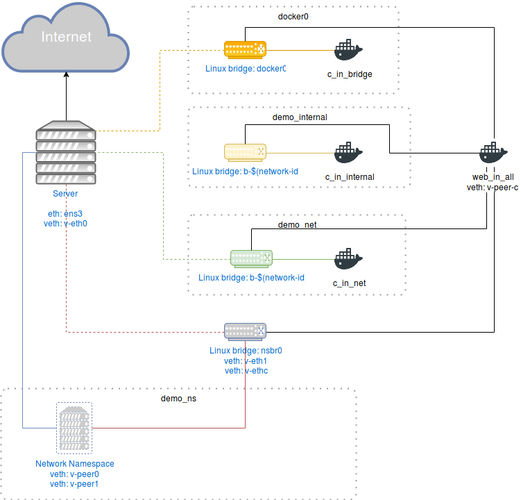

---

# Docker Networking

This is a write up of my docker networking demo at the Docker Orlando meetup.

Let's begin with the diagram.

We can see in *figure 1* a server which can be a physical device or a vm(cloud or not)
connected to the Internet by an interface *ens3* as its gateway interface - *ens3* 
because kvm configures it by default.
Then we have four Linux bridges. One is *docker0* which is the default linux bridge
configured when Docker is set up. It has connection to the outside world, and it has 
inter-container communication enabled by default. Then we have two network segments managed by Docker 
which are *user-defined networks*. These bridges are also Linux bridges. One of these
bridges(*demo_internal*) is an internal network which means it doesn't have connection to the outside, and
the other one(*demo_net*) has connection to the outside world. Finally, there's 
*demo_ns* which is **only a network namespace** and NOT A VIRTUAL SERVER. This
segment has two virtual ethernet interfaces which their final end are connected 
to a Linux bridge *nsbr0*  and to the *server* respectively.

## Docker0

*docker0* is just a Linux bridge with no modifications whatsoever managed by the 
docker engine. It gives the subnet 172.17.0.0/16, so you can fire up plenty of containers 
to play with. An interesting observation is to see if the host's mac address table
 can map as much containers as the network segment valid hosts.
The *docker0* is part of the *docker default networks*. Docker supports three types
of networks: bridge(docker0), none, and host. 
- *Bridge* is just a Linux bridge where all the containers if no network is specified 
are allocated to it. The bridge network is customisable, but the docker daemon needs
to be restarted. Options of this bridge can be found in `docker network inspect bridge`.
- *None* disables network capabilities to containers; in other words, it's attached to itself.
- *Host* adds a container on the host’s network stack.

        curl -fsSL https://download.docker.com/linux/ubuntu/gpg | sudo apt-key add -
        add-apt-repository "deb [arch=amd64] https://download.docker.com/linux/ubuntu  $(lsb_release -cs) stable"
        apt update && apt install docker-ce -y
        systemctl stop docker
        dockerd --icc=false &
        docker network create -o "com.docker.network.kbridge.enable_icc=false" --internal demo_internal
        docker network create demo_net
        docker run -itd --name=c_in_bridge busybox
        docker run -itd --name=c_in_internal --network=demo_internal busybox
        docker run -itd --name=c_in_net --network=demo_net busybox
        docker run -itd --name=web_in_all httpd:2.4
        docker network connect bridge web_in_all
        docker network connect demo_internal web_in_all
        docker network connect demo_net web_in_all
